# 🛠️ Documentación del Proyecto

## 📝 Corrección del Error (Linter)

### 🔍 Corrección del problema con las comillas en [id].js y index.js

#### ❗ Problema detectado:
El linter detectó un error porque en los archivos `api/users/[id].js` y `api/users/index.js` se estaban utilizando comillas simples (') en lugar de comillas dobles ("). El proyecto está configurado para que el linter reconozca comillas dobles.

#### ✅ Solución aplicada:

##### Revisión de los ficheros afectados:
- Se identificaron los archivos `api/users/[id].js` y `api/users/index.js` como problemáticos según los logs del linter.

##### Actualización de las comillas:
- Se sustituyeron todas las comillas simples por comillas dobles en los ficheros mencionados.

#### 📄 Ejemplos:

**Antes de la corrección:**
```sh
// api/users/[id].js 
// api/users/index.js
    case 'GET':
      return getUserById();
```

**Después de la corrección:**

```sh
// api/users/[id].js
// api/users/index.js
    case "GET":
      return getUserById();
```

#### 🚀 Validación:
```sh
npm run lint
```

#### 📊 Resultado:
✨ El linter se ejecuta sin ningún error ni warning.

#### 📸 Evidencias:
- Modificación: 
    
- .yml compilado: 
    

---

## 🧪 Documentación de Cypress

### ⚙️ Añadido a Configuración yml:


### 🔄 Proceso de validación:
Los cambios se verifican mediante commit en https://github.com/JavierTomasTormo/nodejs-blog-practica/actions/
- Estado de GitHub Actions: 

### 📈 Resultados:
- Tests de Cypress: 
    

---

## 🏆 Documentación de Badge

### ⚙️ Configuración yml:


### 🔄 Proceso de validación:
Los cambios se verifican mediante commit en https://github.com/JavierTomasTormo/nodejs-blog-practica/actions/
- Estado de GitHub Actions: 

### 📊 Resultados:
- Resultados de Cypress: 

---

## 🏆 Documentación de Deploy

### ⚙️ Configuración yml:


### 🔄 Proceso de validación:
Los cambios se verifican mediante commit en https://github.com/JavierTomasTormo/nodejs-blog-practica/actions/
- Estado de GitHub Actions: 

### 📊 Resultados:
- Resultados del Deploy: 

## 🏆 Documentación de Notifications

### ⚙️ Configuración yml:


### 🔄 Proceso de validación:
Los cambios se verifican mediante commit en https://github.com/JavierTomasTormo/nodejs-blog-practica/actions/
- Estado de GitHub Actions: 

### 📊 Resultados:
- Resultados del Deploy: 

## Metricas




RESULTAT DELS ÚLTIMS TESTS
